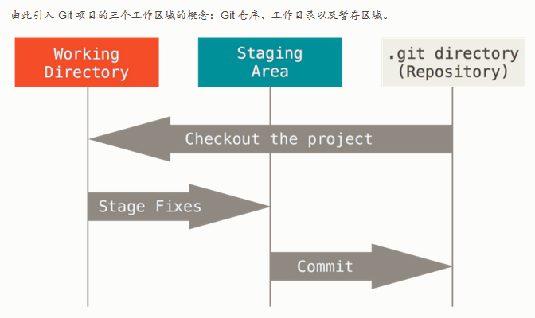

Git的三个区域：

基本的 Git 工作流程如下：

1. 在工作目录中修改文件。
2. 暂存文件，将文件的快照放入暂存区域。
3. 提交更新，找到暂存区域的文件，将快照永久性存储到 Git 仓库目录。

如果 Git 目录中保存着的特定版本文件，就属于已提交状态。 如果作了修改并已放入暂存区域，就属于已暂存状态。 如果自上次取出后，作了修改但还没有放到暂存区域，就是已修改状态。

---

创建版本库：cd到一个目录，git init 创建一个git 版本库，目录内出现.git隐藏目录；

添加新文件：  先 git add filename把文件加到stage里，再git commit -m "logmessage"提交stage里的更改到版本库；

删除文件：git rm filename

git rm --cached readme1.txt  删除readme1.txt的跟踪，并保留在本地。

git rm -f readme1.txt  删除readme1.txt的跟踪，并保留在本地。

修改更新文件：先git add，再git commit ；（git commit 只会提交stage里的修改）

撤销工作区的修改（git add前）：git checkout -- filename

撤销stage里的修改（git add后 commit前）：git reset HEAD filename

撤销提交到版本库里的修改：版本回退

查看当期状态：git status

显示从最近到最远的提交日志 git log ;

git log --pretty=oneline 用一行显示一次提交记录

git log --graph 图形显示分支路线

将版本回退到上一个版本 git reset --hard HEAD^ ；

HEAD 当前版本  HEAD^上个版本  HEAD^^ 上上个版本  HEAD~40上40个版本

跳到某一个版本  git reset --hard 12ea  (12ea是要跳到的那个版本的commit id前四位)

查看命令历史 git reflog

移动文件(改名)： git mv srcname dstname

查看工作区和版本库里的区别：git diff HEAD(所有)  git diff -- filename(指定文件)

写远程仓库使用的 Git 保存的简写与其对应的 URL: git remote -添加一个新的远程 Git 仓库，同时指定一个你可以轻松引用的简写: git remote add <shortname> <url> clone 命令克隆了一个仓库，命令会自动将其添加为远程仓库并默认以 “origin” 为简写。

git fetch 命令会将数据拉取到你的本地仓库——它并不会自动合并或修改你当前的工作。当准备好时你必须手动将其合并入你的工作

创建分支：git branch branch-name

切换到分支：git checkout branch-name

查看分支：git branch

合并分支：git merge branch-name

删除分支：git branch -d branch-name

从远程克隆仓库：git clone git@github.com:xxxx/pro.git

git stash [指定的stash号]:存储当前工作状态，之后工作区是clean的，此时可以去修改bug去了

git stash list：查看保存的工作状态

git stash drop: 删除stash的工作状态

恢复stash的工作状态：git stash apply  (回复后stash不会删除)

git stash pop:恢复工作状态并删除stash里的工作状态

当你从远程仓库克隆时，实际上Git自动把本地的master分支和远程的master分支对应起来了，并且，远程仓库的默认名称是origin。

git pull 从远程抓取分支

一般先git fetch 再git merge。

git push origin branch-name 从本地推送分支branch-name到origin，如果失败，先pull

从本地创建和远程分支对应的分支 git checkout -b branch-name origin/branch-name

建立本地分支和远程分支的关联 git branch --set-upstream-to=origin/master master

密码缓存，输入一次后下次不用再输入，知道密码过期
git config --global credential.helper cache 
git config --global credential.helper 'cache --timeout=3600'

---

Git将版本库（.git目录）放在工作区根目录下，当在Git工作区的某个子目录下执行操作时，会在工作区目录中依次向上递归寻找.git目录，找到的.git目录就是工作区对应的版本库，.git所在的目录就是工作区的根目录，文件.git/index记录了工作区文件的状态（就是暂存区的状态）。

---

### rebase 和 merge 

在 Git 中整合来自不同分支的修改主要有两种方法：`merge` 以及 `rebase`。

merge 三方合并：它会把两个分支的最新快照(各自最新结果)以及二者最近的共同祖先进行三方合并，合并的结果是生成一个新的快照（并提交）。

rebase 变基：可以使用 `rebase` 命令将提交到某一分支上的所有修改都移至另一分支上。

rebase的原理是首先找到这两个分支（即当前分支 `experiment`、变基操作的目标基底分支 `master`）的最近共同祖先 `C2`，然后对比当前分支相对于该祖先的历次提交，提取相应的修改并存为临时文件，然后将当前分支指向目标基底 `C3`, 最后以此将之前另存为临时文件的修改依序应用。

这两种整合方法的最终结果没有任何区别，只不过提交历史不同,变基使得提交历史更加整洁。

你在查看一个经过变基的分支的历史记录时会发现，尽管实际的开发工作是并行的，但它们看上去就像是串行的一样，提交历史是一条直线没有分叉。

git checkout experiment
git rebase master
git checkout master
git merge experiment

只对尚未推送或分享给别人的本地修改执行变基操作清理历史，从不对已推送至别处的提交执行变基操作，这样，你才能享受到两种方式带来的便利。

只要你把变基命令当作是在**推送前**清理提交使之整洁的工具，并且**只在从未推送至共用仓库的提交上**执行变基命令，就不会有事。 假如在那些**已经被推送至共用仓库的提交上**执行变基命令，并因此丢弃了一些别人的开发所基于的提交，那你就有大麻烦了，你的同事也会因此鄙视你。

---

