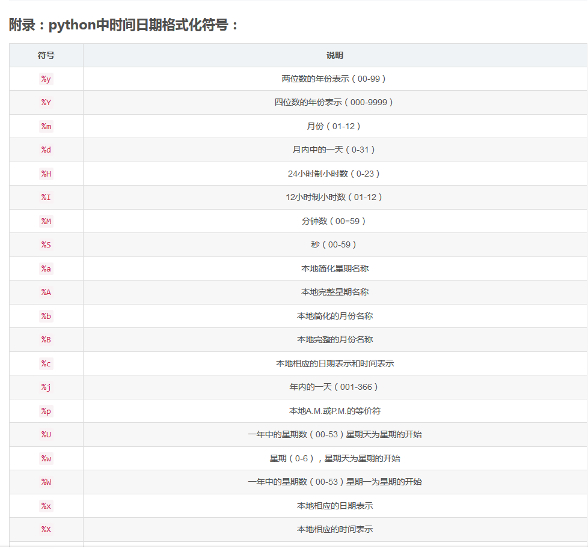

```Python
#转换时间字符串为格式时间
from dateutil import parser
parser.parse(time_string)    # 返回datetime.datetime


import datetime
# 格式化输出时间
datetime.datetime.now().strftime("%Y-%m-%d %H:%M:%S")
----> '2020-07-17 15:14:31'

```