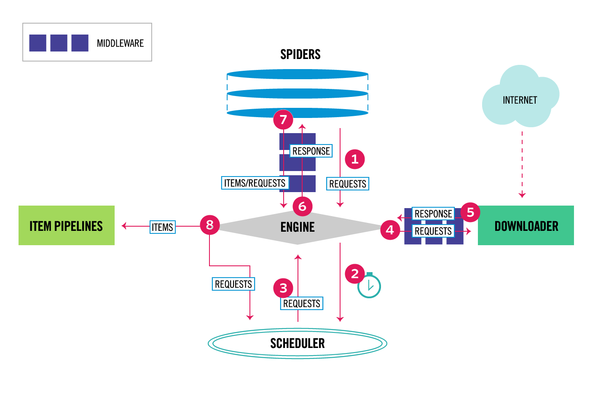
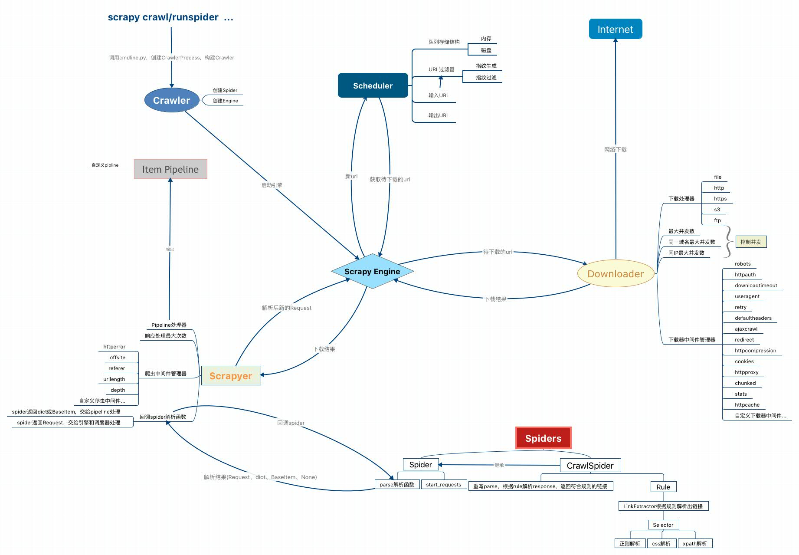

数据流由Engine控制，控制流如下：
1.Engine从Spider获取首个Request；
2.Engine把Request送到Scheduler由其调度，并等待下一个Request；
3.Scheduler返回一个Request给Engine；
4.Engine发送Request给Downloader，中间会经过DownloaderMiddlewares（process_request()）；
5.当Downloader下载完Request的页面会产生一个Response，返回给Engine，中间会通过DownloaderMiddlewares（process_response()）；
6.Engine收到response，将其发给Spider，中间会通过SpiderMiddleware（process_spider_input()）；
7.spider处理response并返回Item和新Request给Engine，中间穿过SpiderMiddleware（process_spider_output()）；
8.Engine将Item发给Pipeline，把处理过的新Request发给Scheduler，并请求下一个Request。
9.反复处理（从step 1）直到没有Request调度了。

