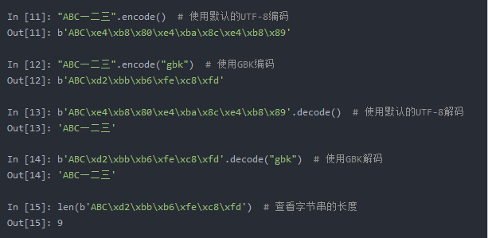
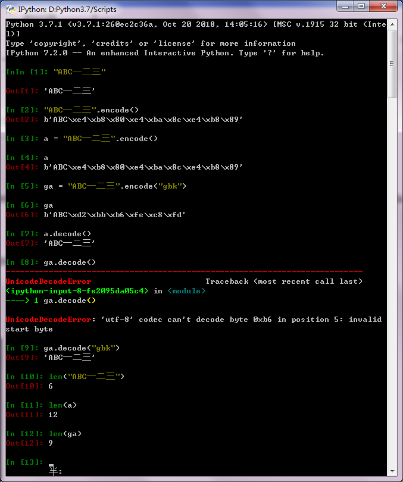

python3 中 字符串是以Unicode编码的，即str在内存里是按Unicode保存的，即一个字符在内存中占据若干个字节。

| 字符 | ASCII    | Unicode           | UTF-8                      |
| ---- | -------- | ----------------- | -------------------------- |
| A    | 01000001 | 00000000 01000001 | 010000001                  |
| 中   | 无       | 01001110 00101101 | 11100100 10111000 10101101 |

1个中文字符经过UTF-8编码后通常会占用3个字节，而1个英文字符只占用1个字节。 

如果按Unicode编码的话会出现浪费存储空间，故又产生了可变长的编码 utf8，在文件存储或网络传输中使用的就是类似utf-8编码后的bytes，当你要显示它们时就需要把这些bytes解码decode成str。

str通过encode()可以编码成指定的bytes。

bytes通过decode()可以解码成str，如果使用了与bytes编码时使用的编码不同的编码，则会乱码报错UnicodeDecodeError。

chardet模块 chardet.detect(bytes) 可以检测bytes对象的编码方式。

Unicode 标准把字符的标识和具体的字节表述进行了如下的明确区分 ：
1 字符的标识， 即码位。例如， 字母 A 的码位是 U+0041，('\u0041') 欧元符号的码位是 U+20AC， 高音谱号的码位是 U+1D11E
2 字符的具体表述取决于所用的编码。 编码是在码位和字节序列之间转换时使用的算法。 在 UTF-8 编码中， A（U+0041） 的码位编码成
单个字节 \x41('\x41')， 而在 UTF-16LE 编码中编码成两个字节\x41\x00。 

把码位转换成字节序列的过程是编码； 把字节序列转换成码位的过程是解码。