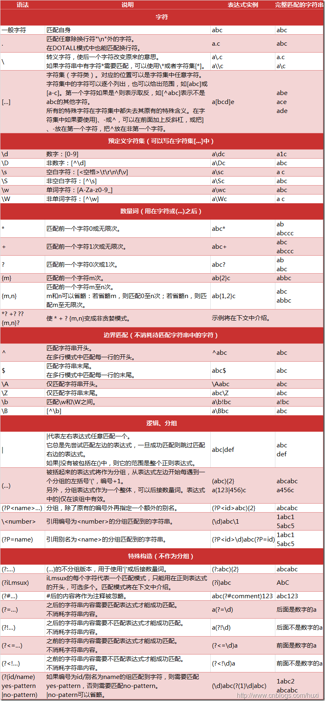

**THINK：正则匹配的东西有位置和字符** 

---

位置类元数据

即像^、$、\b、\B这样的元字符，是用来表示一个位置。作为一个判断条件，匹配的字符需要满足这样的位置信息，但最终匹配的字符串中并不会包含这个样的位置信息。这也是与其他一些元字符所区别的地方，例如表达式中出现\d这样元字符，则最终匹配的字符串中必定需要有数字出现,而\b(\w+)\b表达式匹配的字符串仅仅是一个完整的单词，而不会出现空格等字符来表达位置信息。

---

RE也可以用在替换， 搜索 (\d{3})(-)(\d{3})  匹配 123-345 替换写 $1+$2 会变成123+345  （回溯引用不同语言不同方法 $ 1、\1）

---

"^" ：^会匹配行或者字符串的起始位置，有时还会匹配整个文档的起始位置。 

  "$" ：$会匹配行或字符串的结尾

"\b" :不会消耗任何字符只匹配一个位置，常用于匹配单词边界 如 我想从字符串中"This is Regex"匹配单独的单词 "is" 正则就要写成 "\bis\b" 。

- \b 不会匹配is 两边的字符，但它会识别is 两边是否为单词的边界 
- \b匹配的是一个这样的位置：这个位置位于一个能够用来构成单词的字符（字母数字下划线（\w））和一个不能用来构成单词的字符之间。

  "\B" 匹配不是单词开头或结束的位置

"\d": 匹配数字

"\D" 匹配任意非数字的字符

"\w"：匹配字母，数字，下划线。

 "\W"  匹配任意不是字母，数字，下划线 的字符

"\s"：匹配空白符

 "\S"  匹配任意不是空白符的字符

 "[abc]": 字符组 匹配包含括号内元素的字符 

"\[^abc]": 匹配除了abc以外的任意字符

"\x0A" 匹配十六进制的0xA（10）

”\011”匹配八进制的011 （9） 

"."：匹配除了换行符以外的任何字符

 "*"(贪婪):  重复零次或更多

- 例如"aaaaaaaa" 匹配字符串中所有的a 正则： "a*"  会出到所有的字符"a"

   "+"(懒惰) : 重复一次或更多次

-  例如"aaaaaaaa" 匹配字符串中所有的a 正则： "a+" 会取到字符中所有的a字符， "a+"与"a*"不同在于"+"至少是一次而"*" 可以是0次。

  "?"(占有)  重复零次或一次

-   例如"aaaaaaaa" 匹配字符串中的a 正则 ： "a?" 只会匹配一次，也就是结果只是单个字符a

 "{n}" 重复n次

- 例如从"aaaaaaaa" 匹配字符串的a 并重复3次 正则： "a{3}" 结果就是取到3个a字符 "aaa";

 "{n,m}" 重复n到m次

- 例如正则 "a{3,4}" 将a重复匹配3次或者4次 所以供匹配的字符可以是三个"aaa"也可以是四个"aaaa" 正则都可以匹配到

   "{n,}" 重复n次或更多次

-  与{n,m}不同之处就在于匹配的次数将没有上限，但至少要重复n次 如 正则"a{3,}" a至少要重复3次

　"*?"  重复任意次，但尽可能少重复 

-  如 "acbacb" 正则 "a.*?b" 只会取到第一个"acb" 原本可以全部取到但加了限定符后，只会匹配尽可能少的字符 ，而"acbacb"最少字符的结果就是"acb" 

　"+?" 重复1次或更多次，但尽可能少重复

-  与上面一样，只是至少要重复1次

　"??" 重复0次或1次，但尽可能少重复

　"{n,m}?" 重复n到m次，但尽可能少重复

　"{n,}?"  重复n次以上，但尽可能少重复

- 如 "aaaaaaa" 正则 "a{1,}" 最少是1次所以取到结果为 "a"

​     (?#...) 注释，会被忽略

POSIX字符类（并不是所有正则都支持）(使用POSIX字符类时需注意加[]，如[[:digit:]])

| POSIX字符类 | 含义                                                         |
| ----------- | ------------------------------------------------------------ |
| [:digit:]   | 任何数字（等价于[0-9]）                                      |
| [:xdigit:]  | 任何十六进制数字（等价于[a-fA-F0-9]）                        |
| [:alpha:]   | 任何字母（等价于[a-zA-Z]）                                   |
| [:lower:]   | 任何小写字母（等价于[a-z]）                                  |
| [:upper:]   | 任何大写字母（等价于[A-Z]）                                  |
| [:alnum:]   | 任何字母或数字（等价于[a-zA-Z0-9]）                          |
| [:cntrl:]   | ASCII控制字符（ASCII 0~31 和 ASCII 127）（等价于ASCII0到31再加上ASCII127） |
| [:punct:]   | 不属于[:alnum:]和[:cntrl:]的任何字符                         |
| [:blank:]   | 空格或制表符（[\t ]）(注意\t后面有个空格)                    |
| [:space:]   | 任何空白字符，包括空格（[\f\n\r\t\v ]）                      |
| [:print:]   | 任何可打印字符                                               |
| [:graph:]   | 同[:print:],但不包括空格                                     |

---

#### 捕获分组

一个括号内的内容 如 "(\d)\d" 而"(\d)" 这就是一个捕获分组，可以对捕获分组进行 后向引用 (如果后而有相同的内容则可以直接引用前面定义的捕获组，以简化表达式) 如(\d)\d\1 这里的"\1"就是对"(\d)"的后向引用。

如 "zery zery" 正则 \b(\w+)\b\s\1\b 所以这里的"\1"所捕获到的字符也是 与(\w+)一样的"zery"，为了让组名更有意义，组名是可以自定义名字的。

"\b(?<name>\w+)\b\s\k<name>\b" 用"?<name>"就可以自定义组名了而要后向引用组时要记得写成 "\k<name>";自定义组名后,捕获组中匹配到的值就会保存在定义的组名里。

##### 捕获分组常有的用法：

"(exp)"  匹配exp,并捕获文本到自动命名的组里

"(?<name>exp)"  匹配exp,并捕获文本到名称为name的组里

"(?:exp)" 匹配exp,不捕获匹配的文本，也不给此分组分配组号

以下为零宽断言

"(?=exp)" 匹配exp前面的位置

　　如 "How are you doing" 正则"(?<txt>.+(?=ing))" 这里取ing前所有的字符，并定义了一个捕获分组名字为 "txt" 而"txt"这个组里的值为"How are you do";

"(?<=exp)" 匹配exp后面的位置

　　如 "How are you doing" 正则"(?<txt>(?<=How).+)" 这里取"How"之后所有的字符，并定义了一个捕获分组名字为 "txt" 而"txt"这个组里的值为" are you doing";

"(?!exp)" 匹配后面跟的不是exp的位置

　　如 "123abc" 正则 "\d{3}(?!\d)"匹配3位数字后非数字的结果

"(?<!exp)" 匹配前面不是exp的位置

　　如 "abc123 " 正则 "(?<![0-9])123" 匹配"123"前面是非数字的结果也可写成"(?!<\d)123"

---

另一种解释

**(exp) ：**目标字符串需要匹配exp,并将该分组匹配的子文本保存到自动命名的组里；

**(?<name>exp)：**目标字符串需要匹配exp,并将该分组匹配的子文本保存到名称为name的组里，也可以写成(?'name'exp)；

**(?:exp) ：**目标字符串需要匹配exp,  该括号所包括的内容不会被作为一个分组对待， 即不给此“分组”分配组号，也不会并将该”分组”匹配的子文本保存；该表达式与（exp）在效果上其实应该是没有区别的，区别只是是否算作一个分组及是否保存匹配的子文本。

**(?=exp) ：**定义目标字符串结束位置要求，即紧随目标字符串**后面**出现的字符串**需要匹配上**exp表达式，该字符串不会被计入目标字符串，表达中出现的括号也不会被视作一个分组；

***\*(?!exp)：\****定义目标字符串结束位置要求，即紧随目标字符串**后面**出现的字符串**不能匹配上**exp表达式，该字符串不会被计入目标字符串，表达中出现的括号也不会被视作一个分组；效果上与(?=exp)  表示的情况刚好相反；

**(?<=exp)：**定义目标字符串起始位置要求，即紧邻目标字符串**前面**出现的字符串**需要匹配上**exp表达式，该字符串不会被计入目标字符串，表达中出现的括号也不会被视作一个分组；

**(?<!exp)：**定义目标字符串起始位置要求，即紧邻目标字符串**前面**出现的字符串**不能匹配上**exp表达式，该字符串不会被计入目标字符串，表达中出现的括号也不会被视作一个分组；效果上与(?<=exp)表示的情况刚好相反；

---

