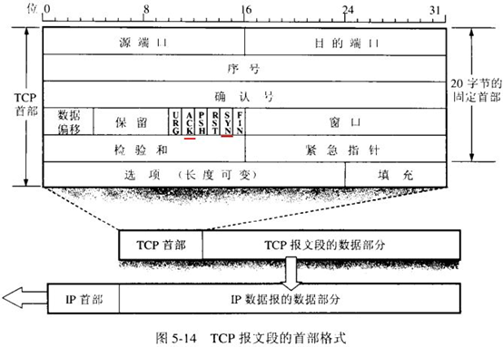
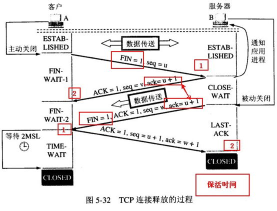
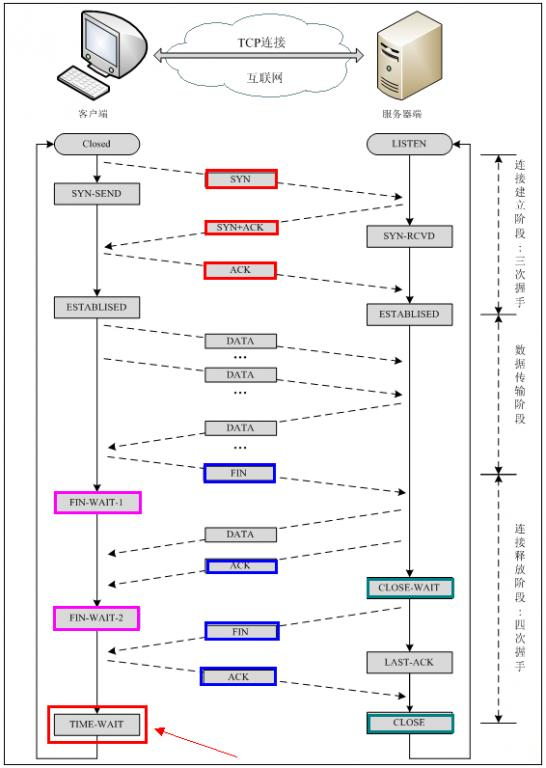
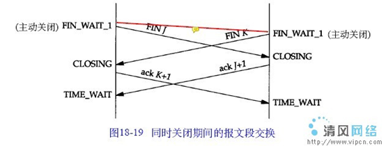
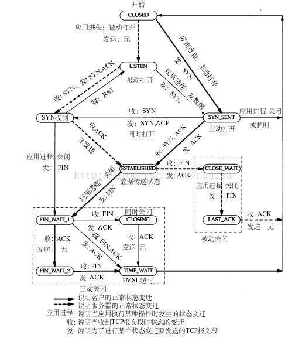

### TCP三次握手建立连接

六个标志位中，我们要用到三个：

- **SYN**：SYN=  1 表示这是一个连接请求或连接接受报文。在建立连接时用来进行同步序号（个人理解是，在建立连接的时候，提醒对方记录本方的起始序号）。当SYN=1而ACK=0时，表明这是一个连接请求报文段。对方若是同意建立连接，则应响应的报文段中使SYN=1、ACK=1。因此SYN=1表示该报文是一个连接请求报文或者是一个连接请求接收报文。
- **ACK**：确认号只有在该位设置为1的时候才生效，当该位为0是表示确认号无效。TCP规定，在TCP连接建立后所有传送的数据报文段ACK都必须设置为1。
- **FIN**：当 FIN = 1 时，表明此报文段的发送方的数据已经发送完毕，并要求释放连接。

此外我们还需要用到序号和确认号：

- **序号**：占4个字节，它的范围在0-2^32-1，序号随着通信的进行不断的递增，当达到最大值的时候重新回到0在开始递增。TCP是面向字节流的，在一个TCP连接中传送的字节流中的每一个字节都按照顺序编号。整个要传送的字节流的起始号必须在连接建立时设置。首部中的序列号字段指的是本报文段所发送的数据的第一个字节的序号。例如，一个报文序号是301，而携带的数据共有100字节。则表示本次报文中的序号是301，下一个报文的序号是401.重复一下，每一个报文的序号是该报文包含的字节中第一个字节的编号。
- **确认号**：占4个字节，确认号，是对下一个想要接受的字节的期望，这里隐式确认了对上一个数据包的成功接收。如上例，在成功接收了序号为301的数据包，想要接收下一个数据包因为上个数据包包含100字节，所以此时的确认号应该是401，表示希望接收下一个序号是401的数据包。

**三次握手过程**：

**过程描述：**

首先由Client发出请求连接即 SYN=1 ACK=0 (请看头字段的介绍)，TCP规定SYN=1时不能携带数据，但要消耗一个序号,因此声明自己的序号是 seq=x。

然后 Server 进行回复确认，即 SYN=1 ACK=1 seq=y，ack=x+1。

再然后 Client 再进行一次确认，但不用SYN 了，这时即为 ACK=1, seq=x+1，ack=y+1。

**为什么要进行三次握手（两次确认）：**

为什么A还要发送一侧确认呢？这主要是为了防止已失效的连接请求报文突然又传送到了B，因而产生错误。

所谓“已失效的连接请求报文段”是这样产生的。考虑一种正常情况。A发出连接请求，但因连接请求丢失而未收到确认。于是A再次重传一次连接请求。后来收到了确认建立了连接。数据传输完毕后，就释放了连接。A共发送了两个连接请求的报文段，其中第一个丢失，第二个到达了B。没有“已失效的连接请求报文段”。

*现假定出现一种异常情况*，*即A发出的第一个连接请求报文段并没有丢失，而是在某些网络节点长时间滞留了，以致延误到连接释放以后的某个时间才到B。*本来这是一个已失效的报文段。但是B收到此失效的连接请求报文段后，就误认为是A有发出一次新的连接请求。于是就向A发出确认报文段，同意建立连接。假定不采用三次握手，那么只要B发出确认，新的连接就建立了。

由于现在A并没有发出建立连接的请求，因此不会理睬B的确认，也不会向B发送数据。但B却以为新的运输连接已经建立了，并一直等待A发来数据。B的许多资源就这样白白浪费了。

采用三次握手的办法可以防止上述现象的发生。例如在刚才的情况下，A不会向B的确认发出确认。B由于收不到确认，就知道A并没有要求建立连接。

**另一种解释：**

这个问题的本质是, 信道不可靠, 但是通信双发需要就某个问题达成一致. 而要解决这个问题,  无论你在消息中包含什么信息, 三次通信是理论上的最小值. 所以三次握手不是TCP本身的要求,  而是为了满足"在不可靠信道上可靠地传输信息"这一需求所导致的. 请注意这里的本质需求**,信道不可靠, 数据传输要可靠**. 三次达到了,  那后面你想接着握手也好, 发数据也好, 跟进行可靠信息传输的需求就没关系了. 因此,如果信道是可靠的, 即无论什么时候发出消息,  对方一定能收到, 或者你不关心是否要保证对方收到你的消息,  那就能像UDP那样直接发送消息就可以了”。这可视为对“三次握手”目的的另一种解答思路。

### 四次挥手关闭连接

当客户A 没有东西要发送时就要释放 A 这边的连接，A会发送一个报文（没有数据），其中 FIN 设置为1,  服务器B收到后会给应用程序一个信，这时A那边的连接已经关闭，即A不再发送信息（但仍可接收信息）。  A收到B的确认后进入等待状态，等待B请求释放连接， B数据发送完成后就向A请求连接释放，也是用FIN=1 表示， 并且用 ack =  u+1(如图）， A收到后回复一个确认信息，并进入 TIME_WAIT 状态， 等待 2MSL 时间。

**为什么要等待呢？**

为了防止这种情况：A接到B的释放连接请求后会发送一个确认信息，但是如果这个确认信息丢了，也就是B没有收到确认释放连接，那么B就会重发一个释放连接请求，这时候A还处于TIME_WAIT状态，所以会再次发送一个确认信息。

**为什么TIME_WAIT 状态还需要等2\*MSL秒之后才能返回到CLOSED 状态呢？**

因为虽然双方都同意关闭连接了，而且握手的4个报文也都发送完毕，按理可以直接回到CLOSED 状态（就好比从SYN_SENT  状态到ESTABLISH  状态那样），但是我们必须假想网络是不可靠的，你无法保证你最后发送的ACK报文一定会被对方收到，就是说对方处于LAST_ACK  状态下的SOCKET可能会因为超时未收到ACK报文，而重发FIN报文，所以这个TIME_WAIT 状态的作用就是用来重发可能丢失的ACK报文。

### 11种状态

**CLOSED**：*初始状态，表示TCP连接是“关闭着的”或“未打开的”。*

**LISTEN** ：*表示服务器端的某个SOCKET处于监听状态，可以接受客户端的连接。*
有提供某种服务才会处于LISTEN状态，TCP状态变化就是某个端口的状态变化，提供一个服务就打开一个端口，例如：提供www服务默认开的是80端口，提供ftp服务默认的端口为21，当提供的服务没有被连接时就处于LISTEN状态。FTP服务启动后首先处于侦听（LISTEN）状态。处于侦听LISTEN状态时，该端口是开放的，等待连接，但还没有被连接。就像你房子的门已经敞开的，但还没有人进来。
    看LISTEN状态最主要的是看本机开了哪些端口，这些端口都是哪个程序开的，关闭不必要的端口是保证安全的一个非常重要的方面，服务端口都对应一个服务（应用程序），停止该服务就关闭了该端口，例如要关闭21端口只要停止IIS服务中的FTP服务即可。关于这方面的知识请参阅其它文章。
    如果你不幸中了服务端口的木马，木马也开个端口处于LISTEN状态。

**SYN_RCVD** ：表示服务器接收到了来自客户端请求连接的SYN报文。在正常情况下，这个状态是服务器端的SOCKET在建立TCP连接时的三次握手会话过程中的一个中间状态，很短暂，基本上用netstat很难看到这种状态，除非故意写一个监测程序，将三次TCP握手过程中最后一个ACK报文不予发送。当TCP连接处于此状态时，再收到客户端的ACK报文，它就会进入到ESTABLISHED 状态。

**SYN_SENT** ：这个状态与SYN_RCVD 状态相呼应，当客户端SOCKET执行connect()进行连接时，它首先发送SYN报文，然后随即进入到SYN_SENT 状态，并等待服务端的发送三次握手中的第2个报文。SYN_SENT 状态表示客户端已发送SYN报文。

 如果连接成功了就变为ESTABLISHED，正常情况下SYN_SENT状态非常短暂。如果发现有很多SYN_SENT出现，那一般有这么几种情况，一是你要访问的网站不存在或线路不好，二是用扫描软件扫描一个网段的机器，也会出出现很多SYN_SENT，另外就是可能中了病毒了，例如中了"冲击波"，病毒发作时会扫描其它机器，这样会有很多SYN_SENT出现。

**ESTABLISHED** ：表示TCP连接已经成功建立。

**FIN_WAIT_1** ：其实FIN_WAIT_1 和FIN_WAIT_2  两种状态的真正含义都是表示等待对方的FIN报文。而这两种状态的区别是：FIN_WAIT_1状态实际上是当SOCKET在ESTABLISHED状态时，它想主动关闭连接，向对方发送了FIN报文，此时该SOCKET进入到FIN_WAIT_1 状态。而当对方回应ACK报文后，则进入到FIN_WAIT_2  状态。当然在实际的正常情况下，无论对方处于任何种情况下，都应该马上回应ACK报文，所以FIN_WAIT_1  状态一般是比较难见到的，而FIN_WAIT_2 状态有时仍可以用netstat看到。

**FIN_WAIT_2** ：上面已经解释了这种状态的由来，实际上FIN_WAIT_2状态下的SOCKET表示半连接，即有一方调用close()主动要求关闭连接。注意：FIN_WAIT_2 是没有超时的（不像TIME_WAIT 状态），这种状态下如果对方不关闭（不配合完成4次挥手过程），那这个 FIN_WAIT_2  状态将一直保持到系统重启，越来越多的FIN_WAIT_2 状态会导致内核crash。

**TIME_WAIT** ：表示收到了对方的FIN报文，并发送出了ACK报文。 TIME_WAIT状态下的TCP连接会等待2*MSL（Max Segment  Lifetime，最大分段生存期，指一个TCP报文在Internet上的最长生存时间。每个具体的TCP协议实现都必须选择一个确定的MSL值，RFC  1122建议是2分钟，但BSD传统实现采用了30秒，Linux可以cat /proc/sys/net/ipv4/tcp_fin_timeout看到本机的这个值），然后即可回到CLOSED  可用状态了。如果FIN_WAIT_1状态下，收到了对方同时带FIN标志和ACK标志的报文时，可以直接进入到TIME_WAIT状态，而无须经过FIN_WAIT_2状态。（这种情况应该就是四次挥手变成三次挥手的那种情况）

**CLOSING** ：这种状态在实际情况中应该很少见，属于一种比较罕见的例外状态。正常情况下，当一方发送FIN报文后，按理来说是应该先收到（或同时收到）对方的ACK报文，再收到对方的FIN报文。但是CLOSING  状态表示一方发送FIN报文后，并没有收到对方的ACK报文，反而却也收到了对方的FIN报文。什么情况下会出现此种情况呢？那就是当双方几乎在同时close()一个SOCKET的话，就出现了双方同时发送FIN报文的情况，这是就会出现CLOSING 状态，表示双方都正在关闭SOCKET连接。

**CLOSE_WAIT** ：表示正在等待关闭。怎么理解呢？当对方close()一个SOCKET后发送FIN报文给自己，你的系统毫无疑问地将会回应一个ACK报文给对方，此时TCP连接则进入到CLOSE_WAIT状态。接下来呢，你需要检查自己是否还有数据要发送给对方，如果没有的话，那你也就可以close()这个SOCKET并发送FIN报文给对方，即关闭自己到对方这个方向的连接。有数据的话则看程序的策略，继续发送或丢弃。简单地说，当你处于CLOSE_WAIT 状态下，需要完成的事情是等待你去关闭连接。

**LAST_ACK** ：当被动关闭的一方在发送FIN报文后，等待对方的ACK报文的时候，就处于LAST_ACK 状态。当收到对方的ACK报文后，也就可以进入到CLOSED 可用状态了。

**CLOSING状态：**

**TCP状态转移**：

